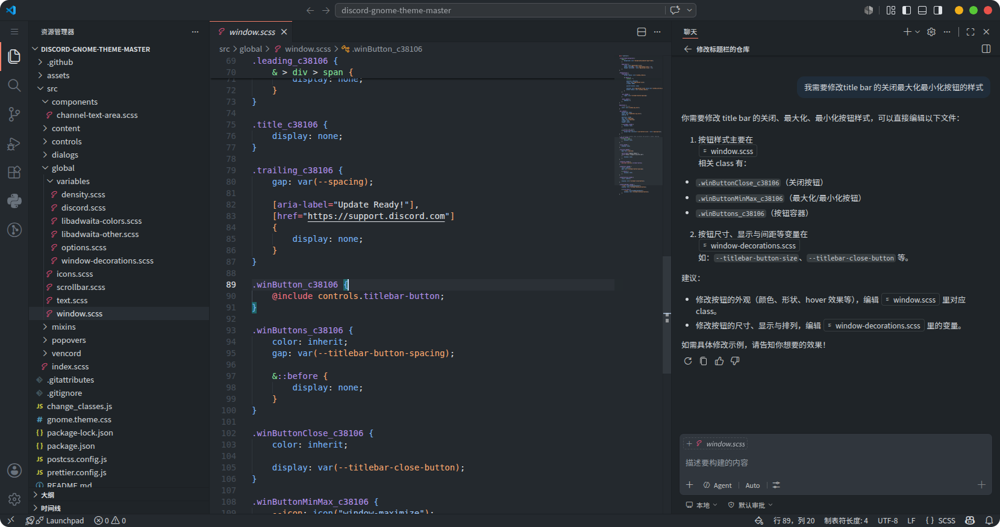

# 中文
一个适用于vscode的CSS样式，该样式能让vscode具有whitesur-gtk风格的标题栏按钮。修改自[FengZhongShaoNian/whitesur-gtk-style-titlebuttons-for-vscode](https://github.com/FengZhongShaoNian/whitesur-gtk-style-titlebuttons-for-vscode),调整了按钮的间距，与 whitesur 主题一致

whitesur-gtk-vscode.css文件需要搭配vscode插件[Custom CSS and JS Loader](https://marketplace.visualstudio.com/items?itemName=be5invis.vscode-custom-css)使用。

效果：

